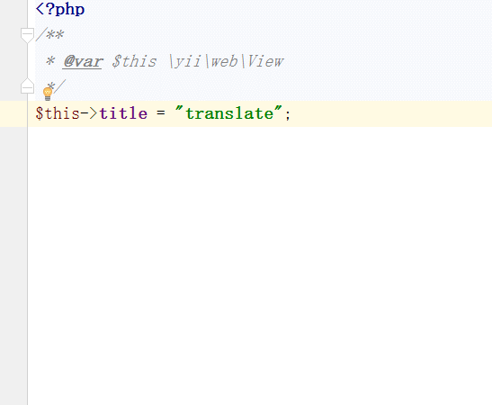

# Yii::t
phpstorm plugins, to help you quickly enter Yii::t translate Example: Yii::t('app','Hello world');

## Use
* select the text "translate"
* Alt+3
* Yii::t("app","translate") has autocomplete

Good luck;